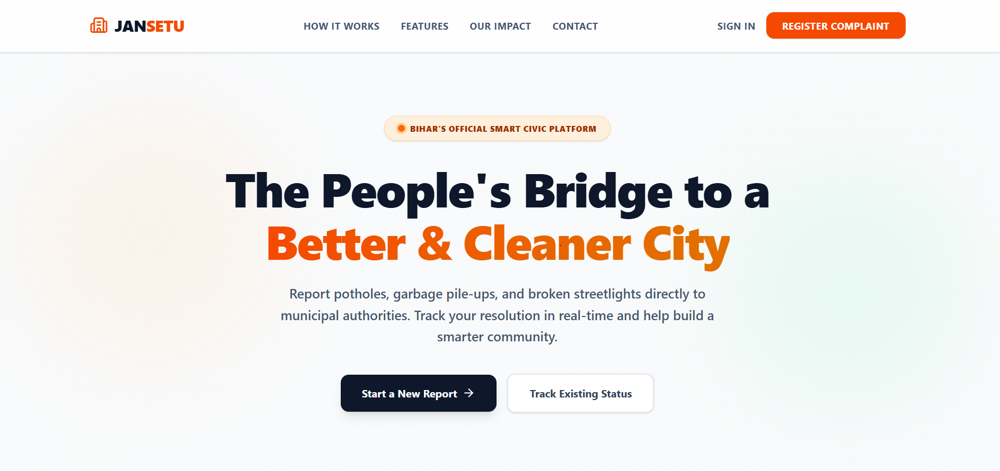

# JanSetu

A full-stack civic grievance management platform that enables citizens to report public infrastructure issues, upload supporting images, and track complaint progress through a role-based resolution workflow.

The system connects Citizens, Municipal Officers, Field Workers, and Administrators through dedicated dashboards and protected workflows. It uses JWT-based authentication, role-based authorization, Cloudinary image storage, and a REST API built with Node.js and Express.js.

🔗 **Live Application:** https://jansetu-zeta.vercel.app/

## Key Features

* Role-based access for Citizens, Officers, Workers, and Administrators
* Complaint submission with category, location details, and multiple images
* Unique complaint ID generation for tracking
* Automatic department mapping based on complaint category
* Complaint status and progress tracking
* Officer-based complaint review, priority management, and worker assignment
* Dedicated task dashboard for field workers
* Progress updates and work notes for assigned complaints
* Admin dashboard for user and system management
* JWT-based authentication and protected API routes
* Cloudinary integration for complaint image storage
* Responsive user interface for different user roles

## Application Workflow

The platform follows a role-based complaint resolution workflow:

```text
Citizen
   ↓
Submits Complaint
   ↓
Category-Based Department Mapping
   ↓
Officer Reviews Complaint
   ↓
Priority Set + Worker Assigned
   ↓
Worker Updates Progress
   ↓
Complaint Status Updated
   ↓
Citizen Tracks Progress
```

## Role-Based Workflow

### Citizen

Citizens can register and log in, submit complaints with location details and supporting images, view their submitted complaints, and track complaint progress.

### Municipal Officer

Officers can review complaints, inspect complaint details and evidence, set priorities, assign field workers, and manage complaint status.

### Field Worker

Workers can view tasks assigned to them and update task progress with status changes and work notes.

### Administrator

Administrators can register officials and workers, view system statistics, and access role- and department-based user information.

## System Architecture

```text
React + Vite Frontend
          ↓
       REST API
          ↓
Node.js + Express.js Backend
          ↓
 Authentication & Role Authorization
          ↓
 Controllers and Business Logic
        ↙       ↘
 MongoDB Atlas   Cloudinary
 User & Complaint   Images
      Data
```

## Technology Stack

**Frontend:** React, Vite, Tailwind CSS

**Routing & Communication:** React Router, Axios

**Backend:** Node.js, Express.js, REST API

**Database:** MongoDB, Mongoose

**Authentication:** JWT, bcryptjs

**Image Handling:** Multer, Cloudinary

**Deployment:** Vercel, Render, MongoDB Atlas

## Project Structure

```text
JanSetu/
│
├── client/
│   ├── src/
│   │   ├── components/
│   │   ├── layouts/
│   │   ├── pages/
│   │   ├── services/
│   │   └── utils/
│   └── package.json
│
├── server/
│   ├── src/
│   │   ├── config/
│   │   ├── controllers/
│   │   ├── database/
│   │   ├── middleware/
│   │   ├── models/
│   │   ├── routes/
│   │   └── utils/
│   ├── server.js
│   └── package.json
│
└── README.md
```

## Installation and Setup

Clone the repository:

```bash
git clone https://github.com/Surbhikumari-2109/Jansetu.git
cd Jansetu
```

### Backend Setup

Navigate to the server directory and install dependencies:

```bash
cd server
npm install
```

Create a `.env` file inside the `server` directory:

```env
PORT=5000
MONGO_URI=your_mongodb_connection_string
JWT_SECRET=your_jwt_secret

CLOUDINARY_CLOUD_NAME=your_cloudinary_cloud_name
CLOUDINARY_API_KEY=your_cloudinary_api_key
CLOUDINARY_API_SECRET=your_cloudinary_api_secret
```

Start the backend server:

```bash
npm run dev
```

### Frontend Setup

Open another terminal and navigate to the client directory:

```bash
cd client
npm install
npm run dev
```

Open the local URL displayed by Vite in the terminal.

## Security and Access Control

The application uses JWT-based authentication to protect user sessions and backend endpoints.

Role-based authorization controls access to operations such as complaint submission, complaint assignment, worker progress updates, and administrative functionality. Passwords are hashed using bcryptjs before being stored in the database.

## Image Upload Workflow

```text
User Selects Images
        ↓
Multipart Form Submission
        ↓
Multer Memory Storage
        ↓
Cloudinary Upload
        ↓
Secure Image URLs
        ↓
Stored with Complaint Data in MongoDB
```

## Future Improvements

* Map-based complaint visualization
* Email and SMS notifications for status updates
* Resolution evidence uploads
* Department performance analytics
* Citizen feedback and satisfaction ratings


## Application Preview

### Landing Page




## Author

**Surbhi Kumari**

GitHub: https://github.com/Surbhikumari-2109
